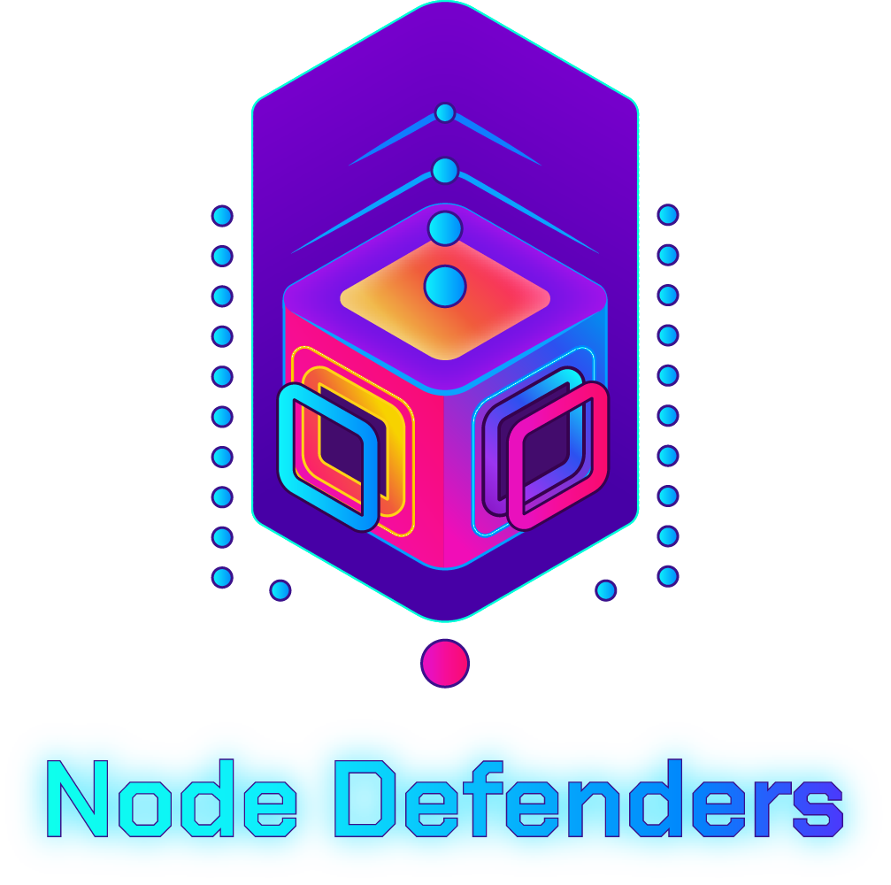

# Node Defenders

Node Defenders is a blockchain-based tower defense game built on the Scroll network. Players defend their nodes against waves of enemies, stake tokens to upgrade defenses, and earn rewards in the form of GODS and SOUL tokens.



## Project Overview

In Node Defenders, players:

- Place and upgrade different types of nodes (Validator, Harvester, Defender, Attacker)
- Defend against waves of increasingly difficult enemies
- Earn GODS tokens for defeating enemies and SOUL tokens from resource generation
- Stake tokens to enhance node capabilities
- Participate in a fully on-chain gaming economy

## Architecture

This project consists of four main components that work together:

1. **Frontend (NextJS)**: The web application that provides the UI, wallet integration, and embeds the Unity game
2. **Unity Game**: The core gameplay component, handling rendering, game mechanics, and real-time interactions
3. **Backend Server**: Manages game state synchronization, handles token distribution, and coordinates multiplayer aspects
4. **Smart Contracts**: Handles the dual token system, staking mechanics, and reward distribution

```
┌───────────────────┐                       ┌─────────────────┐
│                   │       WebSockets      │                 │
│  NextJS Frontend  │<─────────────────────>│                 │
│                   │                       │                 │
└─┬───────┬─────────┘                       │                 │
  │       │                                 │ Node.js Backend │
  │       │ embeds                          │                 │
  │       ▼                                 │                 │
  │  ┌─────────────────┐     WebSockets     │                 │
  │  │                 │<─────────────────> │                 │
  │  │   Unity WebGL   │                    │                 │
  │  │                 │                    └────────┬────────┘
  │  └─────────────────┘                             │
  │                                                  │
  │                                                  │
  └────────────────────────┐       ┌─────────────────┘
                           ▼       ▼
                     ┌───────────────────┐
                     │                   │
                     │  Smart Contracts  │
                     │                   │
                     └───────────────────┘
```

## Repository Structure

This repository is organized into the following directories:

- `/frontend`: NextJS application providing the web interface and wallet integration
- `/unity`: Unity project that renders the game and handles core gameplay
- `/backend`: Node.js server for game state management and WebSocket communication
- `/contracts`: Solidity smart contracts for the dual token system and staking mechanics

## Tech Stack

### Frontend

- Next.js
- React
- TailwindCSS
- wagmi/viem
- RainbowKit
- react-unity-webgl

### Game

- Unity 2021.3+
- WebGL
- NativeWebSocket
- TextMeshPro

### Backend

- Node.js
- WebSockets
- ethers.js
- Express

### Blockchain

- Solidity 0.8.20
- OpenZeppelin Contracts
- Scroll Network

## Getting Started

### Prerequisites

- Node.js (v16+)
- npm or yarn
- Unity 2021.3 LTS or newer with WebGL build support
- Metamask or other Ethereum wallet
- Access to Scroll network (mainnet or testnet)

### Installation

1. Clone the repository

   ```bash
   git clone https://github.com/yourusername/node-defenders.git
   cd node-defenders
   ```

2. Set up each component following their respective README files:

   - [Frontend Setup](./frontend/README.md)
   - [Backend Setup](./backend/README.md)
   - [Unity Setup](./unity/README.md)
   - [Smart Contracts Setup](./contracts/README.md)

3. Configure environment variables by creating `.env` files in the frontend and backend directories.

4. Build the Unity WebGL project and place it in the frontend's public directory.

5. Start the development servers:

   ```bash
   # Terminal 1 - Start backend
   cd backend
   npm run dev

   # Terminal 2 - Start frontend
   cd frontend
   npm run dev
   ```

6. Open [http://localhost:3000](http://localhost:3000) in your browser to play the game.

## Development Workflow

### Adding New Node Types

1. Define the type in the Unity project
2. Update the backend server to handle the new node type
3. Add UI components to the frontend
4. Update the smart contracts if necessary for token interactions

### Testing

1. Test smart contracts on Scroll Sepolia testnet
2. Test backend server with mock data
3. Test Unity game in editor
4. Test frontend with deployed backend and contracts

## Deployment

### Smart Contracts

1. Deploy to Scroll network
2. Verify contracts on Scrollscan
3. Update environment variables with new contract addresses

### Backend

1. Deploy to your hosting provider (AWS, Digital Ocean, etc.)
2. Set up SSL for secure WebSocket connections
3. Configure environment variables with production values

### Frontend

1. Build the NextJS application
2. Deploy to Vercel, Netlify, or your preferred hosting service
3. Ensure environment variables are correctly set

### Unity

1. Build for WebGL with production settings
2. Ensure WebSocket URLs are configured for production
3. Place build in frontend's public directory before deploying

## License

Apache License 2.0

```
Copyright 2025

Licensed under the Apache License, Version 2.0 (the "License");
you may not use this file except in compliance with the License.
You may obtain a copy of the License at

    http://www.apache.org/licenses/LICENSE-2.0

Unless required by applicable law or agreed to in writing, software
distributed under the License is distributed on an "AS IS" BASIS,
WITHOUT WARRANTIES OR CONDITIONS OF ANY KIND, either express or implied.
See the License for the specific language governing permissions and
limitations under the License.
```

## Acknowledgements

- Built for the Scroll Open Hackathon
- Inspired by traditional tower defense games
- UI design elements inspired by cyberpunk aesthetics
